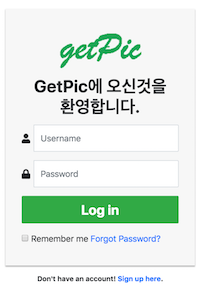
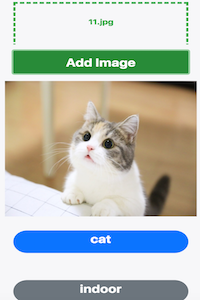

# getpic_vue

> Azure Vision API 를 사용하여 키워드 분석 및 이미지 관리를 하는
  저장형 웹사이트 입니다 (아직 미완성)

# Use What?

> VueJs 기반으로
  Vuex, Vue-router, Vue-modal, Axios, Azure-Vison-API, Firebase 등을 활용

# Preview

> 





## Build Setup

``` bash
# install dependencies
npm install

# serve with hot reload at localhost:8080
npm run dev

# build for production with minification
npm run build
```

## How to Use
회원가입시 KeyCode가 필요합니다 필요하시면 말씀해주세요~ (Azure에서 돈이 나가서....)


For detailed explanation on how things work, consult the [docs for vue-loader](http://vuejs.github.io/vue-loader).
